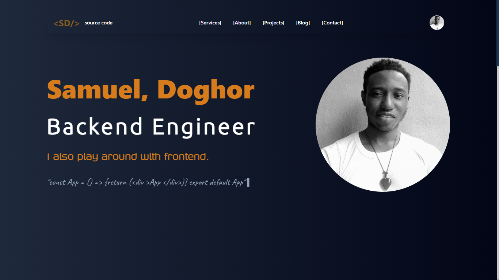

# Hi there - marvo?👋🏿

- 📫 How to reach me **[mailto:talkto@samdoghor.com](talkto@samdoghor.com)**
- ❤️ There is nothing I love to do better than `coding` 🌱

My name is SAMUEL, DOGHOR I'm a passionate backend software engineer with a love for coding. You'll usually find me tapping away at my keyboard, crafting innovative solutions with code, but I also play around with frontend.

## Live

[My Portfolio](https://app.samdoghor.com){:target="_blank" rel="noopener"}

Built with [Vite-React](https://vitejs.dev/){:target="_blank" rel="noopener"}, [TailwindCSS](https://tailwindcss.com/){:target="_blank" rel="noopener"} and hosted with [Vercel](https://vercel.com/){:target="_blank" rel="noopener"}.

## Connect with me

Attribution - Inspired by [Segun Adebayo](https://github.com/segunadebayo/adebayosegun.com)
